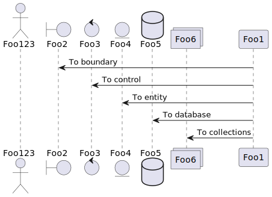
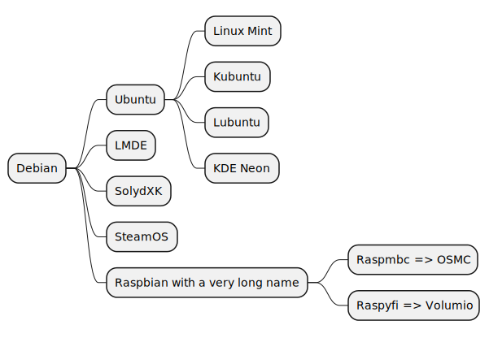

This is examples using the Plantuml diagram generator.

* TODO Add more useful example diagrams here as well as external files

# Examples

Set `plantuml:{filename}` as a fence information. `filename` is used as the file name of generated diagrams. In the following case, `md-sample-sequence.svg` is created.
`filename` is required.

```plantuml:md-sample-sequence
@startuml
actor Foo123
boundary Foo2
control Foo3
entity Foo4
database Foo5
collections Foo6
Foo1 -> Foo2 : To boundary
Foo1 -> Foo3 : To control
Foo1 -> Foo4 : To entity
Foo1 -> Foo5 : To database
Foo1 -> Foo6 : To collections
@enduml
```

`@startuml` can be omitted. This action complements `@startuml` and `@enduml`.

```plantuml:md-sample-class
Class01 <|-- Class02
Class03 *-- Class04
Class05 o-- Class06
Class07 .. Class08
Class09 -- Class10
```

You can also use diagrams other than uml. See https://plantuml.com/ to confirm what kind of diagrams you can use.

```plantuml:md-sample-mindmap
@startmindmap
* Debian
** Ubuntu
*** Linux Mint
*** Kubuntu
*** Lubuntu
*** KDE Neon
** LMDE
** SolydXK
** SteamOS
** Raspbian with a very long name
*** <s>Raspmbc</s> => OSMC
*** <s>Raspyfi</s> => Volumio
@endmindmap
```

Note that this action generates svg data. you can specify only svg supported diagrams. For instance, `ditaa` is not supported.

You can include diagram type in a fence information with format `plantuml@{type}:{filename}`.
In this case, this action complements `@startgantt` and `@endgantt`.

```plantuml@gantt:md-sample-gantt
[Prototype design] lasts 15 days
[Test prototype] lasts 10 days
```

