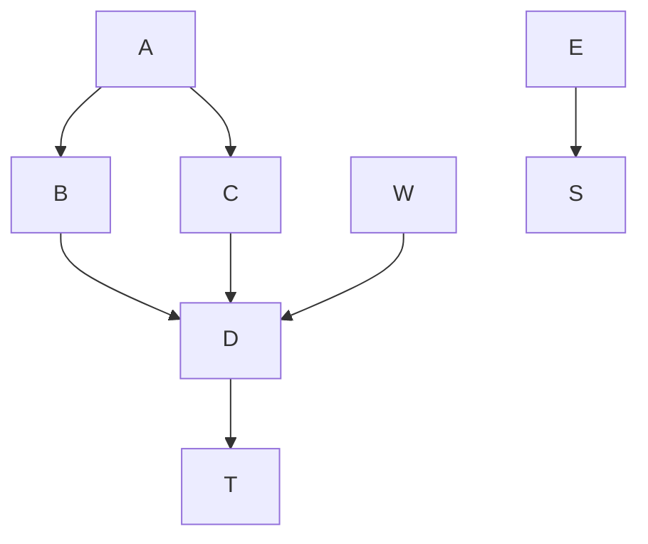
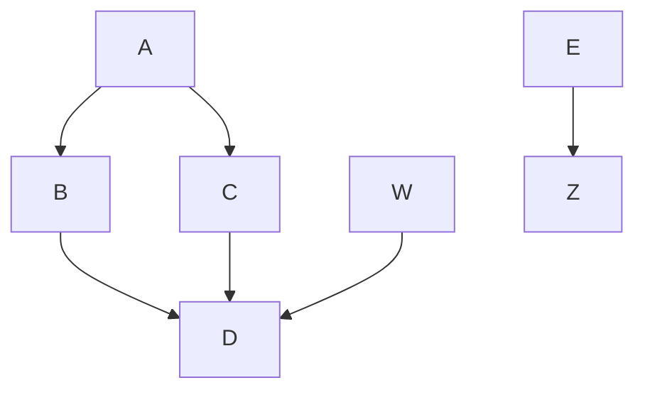

# Mermaid

This demos how to use mermaid with github actions

## Inline mermaid files

<!-- generated by mermaid compile action - START -->

  
Mermaid markup

<!-- generated by mermaid compile action - END -->

<!-- generated by mermaid compile action - START -->

  
Mermaid markup

<!-- generated by mermaid compile action - END -->

## Direct files

See [example.mermaid]
